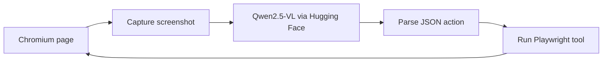

# Web Automation Agent

A vision-guided Python agent that operates a real Chromium browser. At each
step it captures the page, asks a multimodal model what to do next, executes one
Playwright action, and repeats until the task is complete.

## Agent loop



The loop keeps only the newest screenshot in model context, retries transient
model failures, and stops when the model returns `done`, the page closes, 25
steps elapse, or an action repeats too many times.

## Available actions

| Action | Purpose |
|---|---|
| `click_on_screen` | Click pixel coordinates |
| `double_click` | Double-click pixel coordinates |
| `send_keys` | Type into the focused element |
| `press_key` | Send keys such as Enter or Escape |
| `scroll` | Explore or recenter the page |
| `wait` | Pause for a page or animation |
| `done` | Finish the run |

## Quick start

Requirements: Python 3.10 or newer and a Hugging Face token with access to
Inference Providers.

```bash
git clone https://github.com/Raghavendra1729-cell/WEB-AUTOMATION-AGENT.git
cd WEB-AUTOMATION-AGENT
python3 -m venv .venv
source .venv/bin/activate
pip install -r requirements.txt
playwright install chromium
cp .env.example .env
```

Add your token to `.env`:

```dotenv
HF_API_TOKEN=hf_your_token_here
```

Edit the task and starting page in `src/main.py`:

```python
TASK = "Search Wikipedia for artificial intelligence and open the article."
START_URL = "https://www.wikipedia.org/"
```

Then run:

```bash
python3 -m src.main
```

The configured model is
`Qwen/Qwen2.5-VL-72B-Instruct:cheapest` through the Hugging Face
OpenAI-compatible router.

## Project structure

```text
.
├── src/
│   ├── main.py             # Task and starting URL
│   ├── agent/              # Prompt, model call, and control loop
│   ├── tools/              # Browser, mouse, keyboard, scroll, and wait
│   └── utils/              # Environment and logging helpers
├── docs/
│   ├── ARCHITECTURE.md
│   ├── HOW_IT_WORKS.md
│   └── TOOLS_REFERENCE.md
├── requirements.txt
└── .env.example
```

## Design notes

- Screenshots are resized and compressed before model inference.
- Old image payloads are removed so each decision uses the current page state.
- Tool failures are returned to the model, allowing a later step to recover.
- Repeated identical actions trigger a corrective prompt and eventual stop.
- The browser always closes in a `finally` block.

More detail is available in [the architecture guide](docs/ARCHITECTURE.md),
[the walkthrough](docs/HOW_IT_WORKS.md), and
[the tool reference](docs/TOOLS_REFERENCE.md).

## Safety and limitations

This is an experimental coordinate-based agent. It can misread a screenshot,
click the wrong element, or submit unintended data. Use it only on test pages or
low-risk tasks, watch the run, and do not give it payment, identity, or other
sensitive information.

The project does not include DOM-based element targeting, sandboxing, website
allowlists, approval gates, persistent task state, or automated tests.
